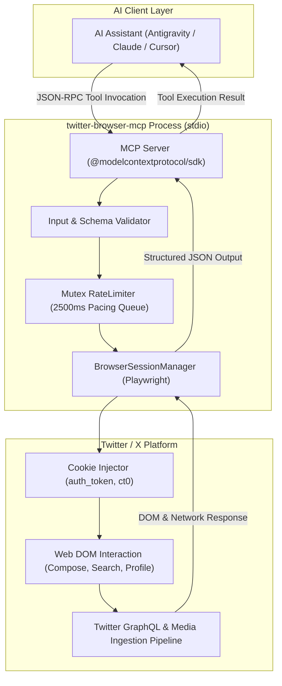
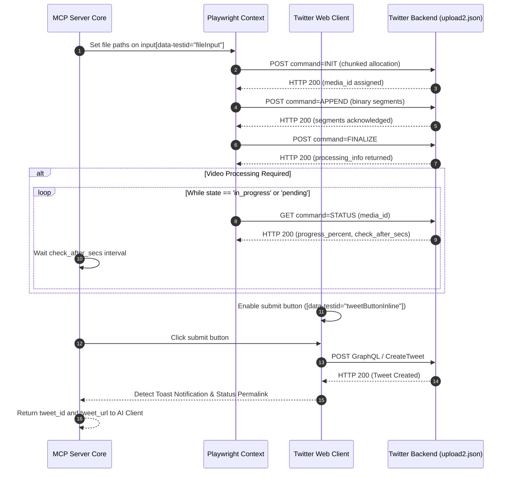

# Twitter / X Browser Model Context Protocol (MCP) Server

[](https://opensource.org/licenses/MIT)
[](https://modelcontextprotocol.io)
[](https://playwright.dev)
[](https://www.typescriptlang.org)
[](test/)

A production-grade, local, browser-automated Model Context Protocol (MCP) server for Twitter / X. It connects Large Language Model (LLM) agents and client environments (such as Antigravity, Claude Desktop, Cursor, and Windsurf) to Twitter without requiring official Twitter Developer API keys, subscriptions, or credit cards.

The server operates via Playwright browser automation using local session cookies, enabling full text posting, media attachments (images, GIFs, and videos with backend transcode detection), search extraction, and user profile inspection.

---

## Table of Contents

1. [Architectural Overview](#architectural-overview)
   - [System Topology](#system-topology)
   - [Media Processing Pipeline](#media-processing-pipeline)
2. [Prerequisites](#prerequisites)
3. [Step-by-Step Cookie Extraction Guide](#step-by-step-cookie-extraction-guide)
   - [Method A: Using Chrome / Brave Developer Tools (Manual)](#method-a-using-chrome--brave-developer-tools-manual)
   - [Method B: Using a Browser Extension (One-Click JSON Export)](#method-b-using-a-browser-extension-one-click-json-export)
4. [Installation and Build](#installation-and-build)
5. [Client Configuration](#client-configuration)
   - [Configuration for Google Antigravity](#1-configuration-for-google-antigravity)
   - [Configuration for Claude Desktop](#2-configuration-for-claude-desktop)
   - [Configuration for Cursor IDE](#3-configuration-for-cursor-ide)
   - [Configuration for Windsurf / Generic Stdio Clients](#4-configuration-for-windsurf--generic-stdio-clients)
6. [MCP Tools Reference](#mcp-tools-reference)
   - [`post_tweet`](#tool-post_tweet)
   - [`search_tweets`](#tool-search_tweets)
   - [`get_profile`](#tool-get_profile)
7. [Environment Variables Reference](#environment-variables-reference)
8. [Account Safety and Anti-Ban Hygiene](#account-safety-and-anti-ban-hygiene)
9. [Verification and Testing](#verification-and-testing)
10. [Troubleshooting and Diagnostic Runbook](#troubleshooting-and-diagnostic-runbook)
11. [License](#license)

---

## Architectural Overview

### System Topology

The server implements the Model Context Protocol over the standard input/output (stdio) transport. When an AI client invokes a tool, the request flows through input validation, a serialized pacing queue to prevent velocity anomalies, and a Playwright browser engine attached to an authenticated Twitter web context.



### Media Processing Pipeline

Uploading videos requires asynchronous handling. Unlike static images, Twitter processes videos through a multi-stage chunked pipeline (`upload2.json`). The server intercepts and monitors upload events before triggering the post action.



---

## Prerequisites

Before installing the server, ensure the following tools are installed on your machine:

1. **Node.js**: Version 18.0.0 or higher (Node.js 20 LTS or Node.js 22 LTS recommended).
   - Check with: `node -v`
2. **npm**: Version 9.0.0 or higher.
   - Check with: `npm -v`
3. **Google Chrome, Brave, or Chromium**: Installed locally to generate and export session cookies.
4. **Git**: Installed locally.

---

## Step-by-Step Cookie Extraction Guide

The server authenticates via your active web session using two primary cookies:
- `auth_token`: A 40-character hexadecimal string representing your authenticated user session.
- `ct0`: The Cross-Site Request Forgery (CSRF) protection token.

Choose either Method A or Method B below to extract these cookies.

### Method A: Using Chrome / Brave Developer Tools (Manual)

1. Open your browser and navigate to [https://x.com](https://x.com). Ensure you are logged into the account you intend to use.
2. Open Developer Tools:
   - macOS: Press `Option + Command + I`
   - Windows / Linux: Press `F12` or `Ctrl + Shift + I`
3. Navigate to the **Application** tab at the top of the Developer Tools window. (If hidden, click the `>>` icon to reveal more tabs).
4. In the left sidebar, expand the **Storage** section.
5. Expand the **Cookies** item and select `https://x.com`.
6. Locate the rows named `auth_token` and `ct0` in the cookie table.
7. Create a file on your local disk at `~/Downloads/x_com_cookies.json` (or any persistent location of your choice) with the following JSON structure, replacing the values with the exact strings copied from the table:

```json
[
  {
    "name": "auth_token",
    "value": "PASTE_YOUR_AUTH_TOKEN_VALUE_HERE",
    "domain": ".x.com",
    "path": "/",
    "secure": true,
    "httpOnly": true
  },
  {
    "name": "ct0",
    "value": "PASTE_YOUR_CT0_VALUE_HERE",
    "domain": ".x.com",
    "path": "/",
    "secure": true,
    "httpOnly": false
  }
]
```

### Method B: Using a Browser Extension (One-Click JSON Export)

1. Install a cookie export extension in your browser, such as:
   - **Export Cookies JSON** (Available in Chrome Web Store)
   - **Cookie-Editor**
2. Navigate to [https://x.com](https://x.com).
3. Click the extension icon in your browser toolbar while on the active `x.com` tab.
4. Select **Export as JSON**.
5. Save the resulting file to your local computer:
   - Suggested path on macOS: `/Users/<YOUR_USERNAME>/Downloads/x_com_cookies.json`
   - Suggested path on Linux: `/home/<YOUR_USERNAME>/.config/twitter/x_com_cookies.json`
   - Suggested path on Windows: `C:\Users\<YOUR_USERNAME>\Downloads\x_com_cookies.json`

---

## Installation and Build

### 1. Clone the Repository

```bash
git clone https://github.com/sparsh101sparsh/twitter-browser-mcp.git
cd twitter-browser-mcp
```

### 2. Install Dependencies

```bash
npm install
```

### 3. Install Playwright Browser Binaries

Playwright requires Chromium binaries to execute headless browser interactions. Run:

```bash
npx playwright install chromium
```

### 4. Compile TypeScript

Compile the TypeScript source files in `src/` into executable JavaScript in `build/`:

```bash
npm run build
```

Verify that `build/index.js` exists and is marked executable:

```bash
ls -la build/index.js
```

---

## Client Configuration

To connect this MCP server to an AI client, add an entry to the client's configuration file pointing to the compiled `build/index.js` file.

### 1. Configuration for Google Antigravity

Open or create `~/.gemini/config/mcp_config.json`:

```json
{
  "mcpServers": {
    "twitter": {
      "command": "node",
      "args": [
        "/ABSOLUTE/PATH/TO/twitter-browser-mcp/build/index.js"
      ],
      "env": {
        "TWITTER_COOKIES_PATH": "/Users/yourusername/Downloads/x_com_cookies.json",
        "HEADLESS": "true",
        "TWITTER_PACING_MS": "2500"
      }
    }
  }
}
```

### 2. Configuration for Claude Desktop

Locate your Claude Desktop configuration file:
- **macOS**: `~/Library/Application Support/Claude/claude_desktop_config.json`
- **Windows**: `%APPDATA%\Claude\claude_desktop_config.json`
- **Linux**: `~/.config/Claude/claude_desktop_config.json`

Add the server to the `mcpServers` object:

```json
{
  "mcpServers": {
    "twitter": {
      "command": "node",
      "args": [
        "/ABSOLUTE/PATH/TO/twitter-browser-mcp/build/index.js"
      ],
      "env": {
        "TWITTER_COOKIES_PATH": "/Users/yourusername/Downloads/x_com_cookies.json",
        "HEADLESS": "true",
        "TWITTER_PACING_MS": "2500"
      }
    }
  }
}
```

After updating the file, completely quit and restart Claude Desktop.

### 3. Configuration for Cursor IDE

In Cursor, navigate to **Settings** -> **Features** -> **MCP Servers** -> **Add New MCP Server**:
- **Name**: `twitter`
- **Type**: `command`
- **Command**: `node /ABSOLUTE/PATH/TO/twitter-browser-mcp/build/index.js`

Add the environment variables in the Cursor environment settings:
- `TWITTER_COOKIES_PATH`: `/ABSOLUTE/PATH/TO/x_com_cookies.json`
- `HEADLESS`: `true`

### 4. Configuration for Windsurf / Generic Stdio Clients

Windsurf and other MCP-compliant clients read stdio servers directly. Point the client to:

- **Executable**: `node`
- **Arguments**: `["/ABSOLUTE/PATH/TO/twitter-browser-mcp/build/index.js"]`
- **Environment**:
  - `TWITTER_COOKIES_PATH=/ABSOLUTE/PATH/TO/x_com_cookies.json`
  - `HEADLESS=true`

---

## MCP Tools Reference

The server exposes three standard tools over stdio.

### Tool: `post_tweet`

Publishes a new post to Twitter / X with optional media attachments.

#### Input Schema
```json
{
  "type": "object",
  "properties": {
    "text": {
      "type": "string",
      "description": "Content of the post (up to 280 characters by default)."
    },
    "media_paths": {
      "type": "array",
      "items": { "type": "string" },
      "description": "List of local absolute file paths to attach."
    },
    "allow_long_tweet": {
      "type": "boolean",
      "description": "Set to true if account has X Premium allowing longer text."
    }
  }
}
```

#### Media Attachment Rules
- **Static Images**: Up to 4 files (`.png`, `.jpg`, `.jpeg`, `.webp`).
- **Videos**: Exactly 1 video file (`.mp4`, `.mov`).
- **GIFs**: Exactly 1 animated GIF file (`.gif`).
- **Constraint**: GIFs cannot be combined with static images or videos.
- **Empty Files**: Zero-byte files are rejected automatically before browser injection.

#### Example Invocations

**Text-only Post:**
```json
{
  "text": "Announcing our new open-source MCP server for automated browser workflows."
}
```

**Post with Video Attachment:**
```json
{
  "text": "Check out this demonstration of automated video ingestion on X.",
  "media_paths": [
    "/Users/yourusername/Movies/project_demo.mp4"
  ]
}
```

**Output Structure:**
```json
{
  "status": "success",
  "message": "Tweet posted successfully",
  "tweet_url": "https://x.com/i/status/2106903737788965355",
  "tweet_id": "2106903737788965355",
  "text": "Announcing our new open-source MCP server for automated browser workflows.",
  "media_count": 0
}
```

---

### Tool: `search_tweets`

Executes keyword, hashtag, or phrase searches on public Twitter feeds.

#### Input Schema
```json
{
  "type": "object",
  "properties": {
    "query": {
      "type": "string",
      "description": "Search keyword, hashtag, or query string."
    },
    "limit": {
      "type": "number",
      "description": "Number of tweets to retrieve (default: 10, maximum: 50)."
    },
    "mode": {
      "type": "string",
      "enum": ["live", "top"],
      "description": "Filter by latest real-time tweets ('live') or top ranked tweets ('top')."
    }
  },
  "required": ["query"]
}
```

#### Example Invocation
```json
{
  "query": "ModelContextProtocol",
  "limit": 10,
  "mode": "live"
}
```

---

### Tool: `get_profile`

Scrapes public profile information and metadata for a specified handle.

#### Input Schema
```json
{
  "type": "object",
  "properties": {
    "username": {
      "type": "string",
      "description": "Twitter handle with or without the leading '@' symbol."
    }
  },
  "required": ["username"]
}
```

#### Example Output Structure
```json
{
  "username": "issparssh",
  "name": "sparsh",
  "handle": "@issparssh",
  "bio": "https://sparsh.is-a.dev",
  "following": "175",
  "followers": "34",
  "joined": "Joined June 2026",
  "verified": true,
  "profile_url": "https://x.com/issparssh"
}
```

---

## Environment Variables Reference

| Variable Name | Type | Default Value | Description |
|---|---|---|---|
| `TWITTER_COOKIES_PATH` | string | `~/Downloads/x_com_cookies.json` | Absolute path to the exported JSON cookie file. |
| `HEADLESS` | boolean | `true` | When `true`, runs Chromium without a visible window. Set to `false` to view browser actions. |
| `TWITTER_PACING_MS` | number | `2500` | Minimum enforced delay in milliseconds between consecutive automated actions. |
| `TWITTER_DEBUG` | boolean | `false` | Enables verbose diagnostic output for DOM and network request tracing. |

---

## Account Safety and Anti-Ban Hygiene

Automating Twitter interactions without official API keys carries inherent detection risks. The server implements defense-in-depth mechanisms based on the `twitter-safe-use` standard:

1. **Velocity Defense**: The internal `RateLimiter` enforces serialized execution. Even if multiple tools are called concurrently by an agent, requests are queued with a minimum 2500ms separation.
2. **Hard Search Caps**: Search pagination is clamped at 50 results maximum. Deep scraping is explicitly prevented.
3. **Fail-Fast on Checkpoints**: If Twitter detects an anomaly and redirects to:
   - `/account/access`
   - `/account/login_challenge`
   - `/i/flow/two-factor-auth`
   - Arkose Captcha (`iframe[src*="arkoselabs"]`)
   
   The server immediately terminates the action and returns an explicit safety alert. **The server will never attempt to programmatically bypass a challenge or captcha.**
4. **Credential Isolation**: Session cookies are maintained strictly in memory and are filtered out of error logs, diagnostic outputs, and tool responses.

---

## Verification and Testing

The repository contains an automated test suite verifying protocol compliance, input validation, rate limiting, and cookie normalization:

### Run Unit and Protocol Tests (39 Tests across 6 Suites)

```bash
npm run test:unit
```

Expected output:
```text
✔ Cookies utility (8 tests)
✔ Guardrails Security Challenges (7 tests)
✔ MCP Protocol Implementation (1 test)
✔ Media Upload Engine and Async Video Finalization (2 tests)
✔ RateLimiter and Pacing (3 tests)
✔ Media and Input Validation (18 tests)

ℹ tests 39
ℹ suites 6
ℹ pass 39
ℹ fail 0
```

### Run Live End-to-End Verification

To verify that the server connects to live Twitter using your extracted cookies:

```bash
npm run test:e2e
```

This script performs a live profile extraction and search query against `x.com` to confirm session validity without modifying your account.

---

## Troubleshooting and Diagnostic Runbook

### Issue 1: "Could not find required cookies: auth_token, ct0"
- **Cause**: The JSON file does not contain the mandatory authentication tokens.
- **Remedy**: Re-export cookies from an active, logged-in browser session on `https://x.com` and ensure both `auth_token` and `ct0` are present.

### Issue 2: "Security challenge detected: /account/access"
- **Cause**: Twitter flagged the session for identity verification (e.g., email or SMS confirmation).
- **Remedy**: Do not retry via the automated server. Open `https://x.com` in a standard desktop browser, complete the verification manually, re-export fresh cookies, and resume.

### Issue 3: "Browser closed unexpectedly or executable missing"
- **Cause**: Playwright browser dependencies have not been installed.
- **Remedy**: Run `npx playwright install chromium` in the repository directory.

### Issue 4: "Tweet exceeds 280 character limit"
- **Cause**: The tweet body exceeds Twitter's standard length constraint.
- **Remedy**: Shorten the text, or set `"allow_long_tweet": true` if your account subscribes to X Premium.

---

## License

This project is licensed under the **MIT License**. See the `LICENSE` file for details.
