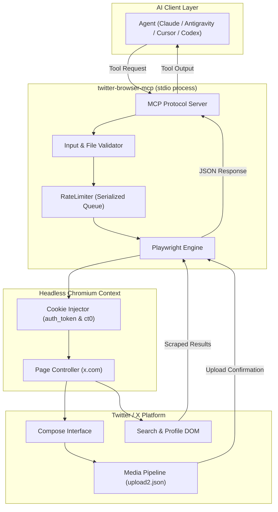
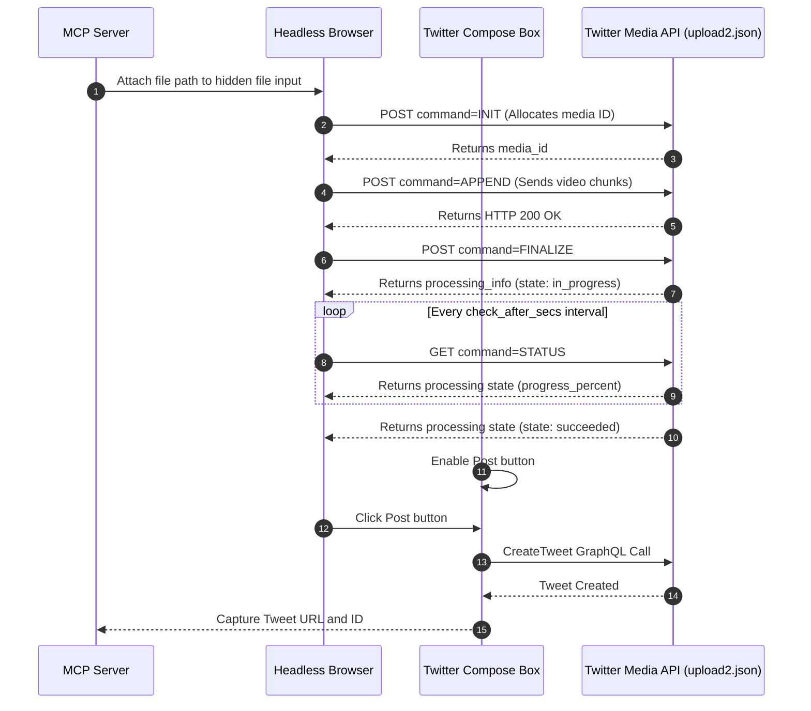
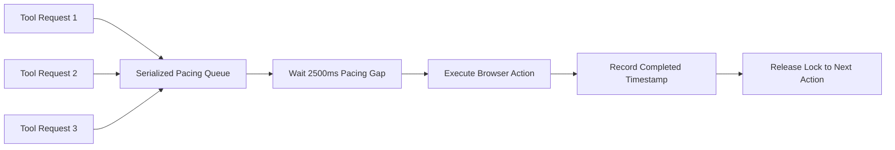

# Twitter / X Browser MCP Server

[](https://opensource.org/licenses/MIT)
[](https://modelcontextprotocol.io)
[](https://playwright.dev)
[](https://www.typescriptlang.org)
[](test/)

A clean, free, browser-automated Model Context Protocol (MCP) server that lets your AI assistant interact with Twitter / X.

You do **not** need a Twitter Developer account, you do **not** need to pay $100 per month for API tiers, and you do **not** need to enter any credit card details. 

The server runs locally on your computer. It uses Playwright to open a private headless browser in the background, loads your exported login cookies, and performs actions on x.com just like a person sitting at a keyboard.

---

## Table of Contents

1. [How It Works](#how-it-works)
2. [What Account Details Do You Need?](#what-account-details-do-you-need)
3. [How to Extract Your Cookies (Step-by-Step)](#how-to-extract-your-cookies-step-by-step)
   - [Method 1: Fast Export Using a Browser Extension (Recommended)](#method-1-fast-export-using-a-browser-extension-recommended)
   - [Method 2: Manual Export Using Browser Developer Tools](#method-2-manual-export-using-browser-developer-tools)
4. [Installation and Build](#installation-and-build)
5. [Client Setup Guides](#client-setup-guides)
   - [Setup in Google Antigravity](#1-setup-in-google-antigravity)
   - [Setup in Claude Desktop](#2-setup-in-claude-desktop)
   - [Setup in Cursor IDE](#3-setup-in-cursor-ide)
   - [Setup in OpenAI Codex / Custom Agent Runners](#4-setup-in-openai-codex--custom-agent-runners)
   - [Setup in Windsurf](#5-setup-in-windsurf)
6. [Available Tools and How to Use Them](#available-tools-and-how-to-use-them)
   - [Posting a Tweet or Media (`post_tweet`)](#1-post_tweet)
   - [Searching Tweets (`search_tweets`)](#2-search_tweets)
   - [Looking up a Profile (`get_profile`)](#3-get_profile)
7. [System Architecture and Workflow Diagrams](#system-architecture-and-workflow-diagrams)
   - [High-Level Request Architecture](#high-level-request-architecture)
   - [Video and Media Upload Lifecycle](#video-and-media-upload-lifecycle)
   - [Rate Limiter and Anti-Bot Pacing Queue](#rate-limiter-and-anti-bot-pacing-queue)
8. [Keeping Your Account Safe (Anti-Ban Rules)](#keeping-your-account-safe-anti-ban-rules)
   - [The Included Antigravity Skill](#the-included-antigravity-skill)
9. [Verification and Testing](#verification-and-testing)
10. [Troubleshooting Guide](#troubleshooting-guide)
11. [License](#license)

---

## How It Works

Traditional Twitter bots send web requests to Twitter's official developer API. Twitter now charges a minimum of $100/month for write access, making hobby and personal bots expensive.

This MCP server takes a different approach:

```text
[ Your AI Assistant ]
       |  (Speaks standard MCP protocol via stdio)
       v
[ twitter-browser-mcp Server ]
       |  (Controls browser with Playwright)
       v
[ Headless Chromium (In Memory) ]
       |  (Injects your session cookies: auth_token & ct0)
       v
[ https://x.com ]
       |  (Posts, searches, and inspects profiles directly on the site)
       v
[ Live Twitter Feed ]
```

Because it uses your real login cookies inside a genuine Chromium browser engine, Twitter treats the session as regular web browsing. You can post text, attach photos, upload videos, and search recent posts completely free.

---

## What Account Details Do You Need?

You do **not** need passwords, phone numbers, or developer API credentials.

You only need **two session cookies** from your browser:

| Cookie Name | What It Is | Example Format |
|---|---|---|
| `auth_token` | Your authenticated user session token | 40-character hexadecimal string (e.g., `a1b2c3d4e5f6...`) |
| `ct0` | Your Cross-Site Request Forgery (CSRF) token | 160-character alphanumeric string |

When you export cookies from x.com, both of these values are included automatically in the resulting JSON file.

---

## How to Extract Your Cookies (Step-by-Step)

### Method 1: Fast Export Using a Browser Extension (Recommended)

This is the easiest and fastest method.

1. Open your browser (Google Chrome, Brave, Edge, or Firefox) and make sure you are logged into [https://x.com](https://x.com).
2. Install a cookie export extension from your browser web store:
   - **Cookie-Editor** (by cgagnier)
   - or **Export Cookies JSON**
3. While looking at any page on `https://x.com`, click the extension icon in your browser toolbar.
4. Click **Export**, then select **Export as JSON**.
5. Save the file to your computer. A great standard location is:
   - macOS: `/Users/<YOUR_USERNAME>/Downloads/x_com_cookies.json`
   - Windows: `C:\Users\<YOUR_USERNAME>\Downloads\x_com_cookies.json`
   - Linux: `/home/<YOUR_USERNAME>/.config/x_com_cookies.json`

---

### Method 2: Manual Export Using Browser Developer Tools

If you prefer not to install browser extensions, you can copy the values directly from your browser:

1. Open [https://x.com](https://x.com) in Chrome or Brave while logged in.
2. Press `Option + Command + I` (on macOS) or `F12` (on Windows/Linux) to open Developer Tools.
3. Click the **Application** tab across the top bar. (If you do not see it, click the double arrow `>>` to view more tabs).
4. In the left panel, find **Storage**, click the arrow next to **Cookies**, and click on `https://x.com`.
5. In the table that appears on the right:
   - Find the row named `auth_token` and double-click its value to copy it.
   - Find the row named `ct0` and double-click its value to copy it.
6. Create a new text file named `x_com_cookies.json` on your computer and paste the following structure:

```json
[
  {
    "name": "auth_token",
    "value": "YOUR_AUTH_TOKEN_VALUE_HERE",
    "domain": ".x.com",
    "path": "/",
    "secure": true,
    "httpOnly": true
  },
  {
    "name": "ct0",
    "value": "YOUR_CT0_VALUE_HERE",
    "domain": ".x.com",
    "path": "/",
    "secure": true,
    "httpOnly": false
  }
]
```

---

## Installation and Build

### Step 1: Clone the Repository

```bash
git clone https://github.com/sparsh101sparsh/twitter-browser-mcp.git
cd twitter-browser-mcp
```

### Step 2: Install Node Dependencies

```bash
npm install
```

### Step 3: Download the Playwright Chromium Engine

Playwright needs its headless browser binary to run. Install it with one command:

```bash
npx playwright install chromium
```

### Step 4: Build the Project

```bash
npm run build
```

This compiles TypeScript in `src/` to `build/index.js`. Verify the file is ready:

```bash
ls -la build/index.js
```

---

## Client Setup Guides

Configure your favorite AI agent or editor to connect to the server. Replace `/ABSOLUTE/PATH/TO/twitter-browser-mcp` with the real path on your machine where you cloned the repository.

### 1. Setup in Google Antigravity

Open or create `~/.gemini/config/mcp_config.json`:

```json
{
  "mcpServers": {
    "twitter": {
      "command": "node",
      "args": [
        "/Users/yourusername/teamwork_projects/twitter_browser_mcp/build/index.js"
      ],
      "env": {
        "TWITTER_COOKIES_PATH": "/Users/yourusername/Downloads/x_com_cookies.json",
        "HEADLESS": "true"
      }
    }
  }
}
```

Antigravity detects the change and registers the tools immediately.

---

### 2. Setup in Claude Desktop

Locate your Claude Desktop configuration file:
- **macOS**: `~/Library/Application Support/Claude/claude_desktop_config.json`
- **Windows**: `%APPDATA%\Claude\claude_desktop_config.json`
- **Linux**: `~/.config/Claude/claude_desktop_config.json`

Add the server under `mcpServers`:

```json
{
  "mcpServers": {
    "twitter": {
      "command": "node",
      "args": [
        "/ABSOLUTE/PATH/TO/twitter-browser-mcp/build/index.js"
      ],
      "env": {
        "TWITTER_COOKIES_PATH": "/ABSOLUTE/PATH/TO/x_com_cookies.json",
        "HEADLESS": "true"
      }
    }
  }
}
```

Restart Claude Desktop completely. You will see the hammer tool icon appear in chat.

---

### 3. Setup in Cursor IDE

1. Open Cursor Settings (`Cmd + ,` on macOS or `Ctrl + ,` on Windows).
2. Go to **Features** -> **MCP Servers**.
3. Click **Add New MCP Server**.
4. Fill in the fields:
   - **Name**: `twitter`
   - **Type**: `command`
   - **Command**: `node /ABSOLUTE/PATH/TO/twitter-browser-mcp/build/index.js`
5. In the environment variables section, add:
   - Key: `TWITTER_COOKIES_PATH`, Value: `/ABSOLUTE/PATH/TO/x_com_cookies.json`
   - Key: `HEADLESS`, Value: `true`

---

### 4. Setup in OpenAI Codex / Custom Agent Runners

For agent environments using the official MCP Python SDK, Node SDK, or subprocess runners:

```python
from mcp import ClientSession, StdioServerParameters
from mcp.client.stdio import stdio_client

server_params = StdioServerParameters(
    command="node",
    args=["/ABSOLUTE/PATH/TO/twitter-browser-mcp/build/index.js"],
    env={
        "TWITTER_COOKIES_PATH": "/ABSOLUTE/PATH/TO/x_com_cookies.json",
        "HEADLESS": "true"
    }
)

async with stdio_client(server_params) as (read, write):
    async with ClientSession(read, write) as session:
        await session.initialize()
        tools = await session.list_tools()
        print("Connected tools:", [t.name for t in tools.tools])
```

---

### 5. Setup in Windsurf

Open your Windsurf global configuration (`~/.codeium/windsurf/mcp_config.json`):

```json
{
  "mcpServers": {
    "twitter": {
      "command": "node",
      "args": [
        "/ABSOLUTE/PATH/TO/twitter-browser-mcp/build/index.js"
      ],
      "env": {
        "TWITTER_COOKIES_PATH": "/ABSOLUTE/PATH/TO/x_com_cookies.json",
        "HEADLESS": "true"
      }
    }
  }
}
```

---

## Available Tools and How to Use Them

### 1. `post_tweet`

Posts a new message to Twitter / X, with optional attachments.

```json
{
  "text": "Hello world! This post was sent from my local AI assistant.",
  "media_paths": [
    "/Users/yourusername/Movies/demo.mp4"
  ]
}
```

#### Media Upload Rules
- **Static Images**: Up to 4 files (`.png`, `.jpg`, `.jpeg`, `.webp`).
- **Video**: Exactly 1 file (`.mp4`, `.mov`). The server automatically waits for backend video transcoding before clicking Post.
- **GIF**: Exactly 1 animated GIF (`.gif`). Twitter does not allow mixing GIFs with other media.
- **Zero-Byte Files**: Empty files are automatically rejected before touching the browser.

---

### 2. `search_tweets`

Searches recent public posts on Twitter by keyword or hashtag.

```json
{
  "query": "#AIagents",
  "limit": 10,
  "mode": "live"
}
```

- `limit`: Number of results to return (default 10, maximum safe limit is 50).
- `mode`: `"live"` for real-time posts, or `"top"` for high-engagement posts.

---

### 3. `get_profile`

Reads public profile metadata for any Twitter handle.

```json
{
  "username": "issparssh"
}
```

Returns structured details including display name, bio, following count, follower count, join date, and verification status.

---

## System Architecture and Workflow Diagrams

### High-Level Request Architecture



---

### Video and Media Upload Lifecycle

Handling video uploads requires waiting for Twitter's backend servers to transcode the video. The server monitors upload events automatically:



---

### Rate Limiter and Anti-Bot Pacing Queue

To keep your account safe, requests do not execute in immediate bursts. They flow through a serialized queue:



---

## Keeping Your Account Safe (Anti-Ban Rules)

Because this tool automates a browser, following simple hygiene rules ensures your account remains active and unflagged:

1. **Human Pacing**: The server enforces a **2500ms minimum delay** between actions. Do not remove this delay.
2. **Search Limits**: Keep searches under **50 results**. Do not paginate deeply through hundreds of pages.
3. **No Automated Spurt Posting**: Limit automated tweets to normal human publishing behavior (1 to 2 posts per session).
4. **Immediate Stop on Security Checkpoints**: If Twitter ever prompts for an Arkose Captcha, SMS code, or email verification, the server stops immediately. **Never try to script past a captcha.** Solve it manually in a real browser, re-export your cookies, and resume.

### The Included Antigravity Skill

This repository includes a pre-built Antigravity / AI Agent skill in [`skills/twitter-safe-use/SKILL.md`](skills/twitter-safe-use/SKILL.md).

To install it into your Antigravity environment:

```bash
mkdir -p ~/.gemini/antigravity/skills/twitter-safe-use
cp skills/twitter-safe-use/SKILL.md ~/.gemini/antigravity/skills/twitter-safe-use/SKILL.md
```

---

## Verification and Testing

Run the included automated test suite to confirm your installation:

```bash
# Run the 39 unit and protocol tests
npm run test:unit
```

Expected output:
```text
✔ Cookies utility (8 tests)
✔ Guardrails Security Challenges (7 tests)
✔ MCP Protocol Implementation (1 test)
✔ Media Upload Engine and Async Video Finalization (2 tests)
✔ RateLimiter and Pacing (3 tests)
✔ Media and Input Validation (18 tests)

ℹ tests 39
ℹ suites 6
ℹ pass 39
ℹ fail 0
```

To run a live test using your real cookies without posting:

```bash
npm run test:e2e
```

---

## Troubleshooting Guide

### 1. "Could not find required cookies: auth_token, ct0"
- **Cause**: The cookie JSON file does not contain your active session credentials.
- **Solution**: Log into `https://x.com` in your browser and re-export the cookies. Ensure both `auth_token` and `ct0` are present in the JSON.

### 2. "Security challenge detected: /account/access"
- **Cause**: Twitter flagged the session for standard identity verification (e.g. email or SMS code).
- **Solution**: Do not retry via the automated server. Open `https://x.com` in your everyday browser, complete the security check manually, re-export fresh cookies, and restart.

### 3. "Executable does not exist at ... chromium"
- **Cause**: Playwright has not downloaded the Chromium browser binary yet.
- **Solution**: Run `npx playwright install chromium` inside the project folder.

### 4. "Tweet exceeds 280 character limit"
- **Cause**: Twitter restricts free accounts to 280 characters.
- **Solution**: Shorten your tweet text, or pass `"allow_long_tweet": true` if your account has an active X Premium subscription.

---

## License

This project is licensed under the **MIT License**. Feel free to use, modify, and distribute it for personal and commercial projects.
