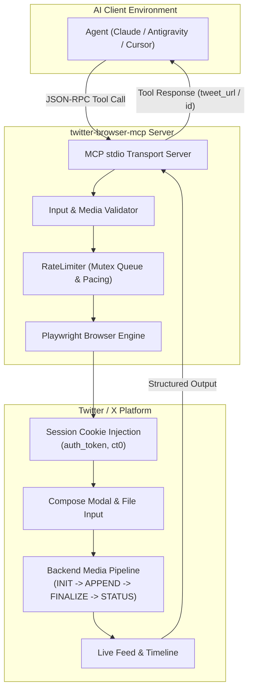
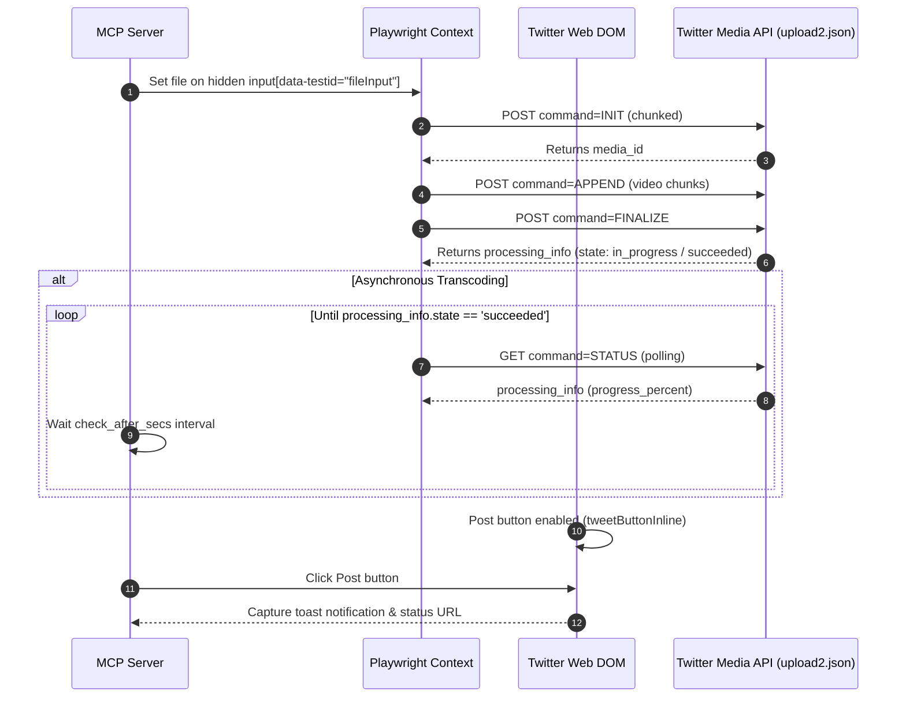

# 🐦 Twitter / X Browser MCP Server

[](https://opensource.org/licenses/MIT)
[](https://modelcontextprotocol.io)
[](https://playwright.dev)
[](https://www.typescriptlang.org)
[](test/)

A production-grade, lightweight, browser-automated **Model Context Protocol (MCP)** server for **Twitter / X**. It allows AI agents (such as Antigravity, Claude Desktop, Cursor, and Windsurf) to post tweets, upload multi-format media (images, GIFs, and videos with backend transcode detection), and query profiles/searches—**100% free with zero official Twitter Developer API fees, no subscriptions, and no credit card required**.

---

## 📑 Table of Contents

- [Why This Server?](#-why-this-server)
- [Architecture Overview](#-architecture-overview)
  - [High-Level Flow](#high-level-flow)
  - [Media Upload & Transcode Lifecycle](#media-upload--transcode-lifecycle)
- [Features](#-features)
- [Security & Safe-Use Guardrails](#-security--safe-use-guardrails)
- [Prerequisites & Getting Cookies](#-prerequisites--getting-cookies)
- [Quick Start](#-quick-start)
- [MCP Client Configuration](#-mcp-client-configuration)
  - [Antigravity](#1-antigravity)
  - [Claude Desktop](#2-claude-desktop)
  - [Cursor / Windsurf / Custom Clients](#3-cursor--windsurf--custom-clients)
- [Tools Specification](#-tools-specification)
  - [`post_tweet`](#post_tweet)
  - [`search_tweets`](#search_tweets)
  - [`get_profile`](#get_profile)
- [Environment Configuration](#-environment-configuration)
- [Development & Testing](#-development--testing)
- [License](#-license)

---

## 💡 Why This Server?

Recent changes to Twitter / X paywalled the developer API (requiring minimum \$100/mo subscriptions for basic tweet posting) and deprecated legacy scraping endpoints (`1.1/guest/activate.json` returns HTTP 404).

**Twitter Browser MCP** bridges this gap:
- **Zero API Fees**: Connects through standard browser session automation.
- **Full Media Support**: Upload photos, GIFs, and videos (MP4/MOV) with native wait conditions.
- **Safety First**: Features serialized request queues, 2500ms pacing, search clamping, and instant security checkpoint detection.

---

## 🏗️ Architecture Overview

### High-Level Flow



---

### Media Upload & Transcode Lifecycle

Handling video uploads in browser automation requires handling asynchronous backend transcoding. The engine hooks directly into Twitter's media upload lifecycle:



---

## ✨ Features

- **MCP stdio Protocol**: Compliant with Model Context Protocol standards using `@modelcontextprotocol/sdk`.
- **Text & Rich Media**:
  - Text tweets up to 280 characters (with X Premium bypass support).
  - Up to 4 static images (`.png`, `.jpg`, `.jpeg`, `.webp`).
  - Single video upload (`.mp4`, `.mov`) with verified transcode polling.
  - Single animated GIF upload (`.gif`).
- **Interactive Search**: Real-time keyword and hashtag search with formatted author metadata, tweet text, engagement metrics, and permalinks.
- **Profile Inspection**: Scrapes bios, handle, follower counts, following counts, and join dates without UI badge bleeding.
- **Headless or Visible**: Toggle between background headless execution or headful browser viewing.

---

## 🛡️ Security & Safe-Use Guardrails

Built directly on `twitter-safe-use` hygiene principles:

| Guardrail | Implementation | Purpose |
|---|---|---|
| **Pacing Limiter** | Mutex-based serialized queue (default 2500ms gap) | Eliminates automated request bursts |
| **Search Clamp** | Hard-capped at 50 tweets maximum | Prevents deep pagination spam |
| **Fail-Fast Defense** | URL & DOM monitors for `/account/access`, Arkose Captchas, and 2FA challenges | Immediately terminates without retrying into an account ban |
| **Credential Safety** | Cookies loaded only in memory; never echoed to logs or stdout | Zero leakage of authentication secrets |

---

## 🍪 Prerequisites & Getting Cookies

The server uses your existing browser session cookies (`auth_token` and `ct0`):

1. Open **[x.com](https://x.com)** in your browser (Chrome, Brave, Edge, etc.) and log in.
2. Open Developer Tools (`F12` or `Cmd + Option + I`).
3. Navigate to: **Application** ➔ **Storage** ➔ **Cookies** ➔ `https://x.com`.
4. Export or copy the cookies:
   - **Recommended**: Use an extension like **"Export Cookies JSON"** or **"Cookie-Editor"** and save as `x_com_cookies.json`.
   - Store it safely (e.g. `~/Downloads/x_com_cookies.json` or `~/.config/twitter/cookies.json`).
   - Ensure the JSON contains at least `auth_token` and `ct0`.

---

## 🚀 Quick Start

### 1. Clone & Build

```bash
git clone https://github.com/sparsh101sparsh/twitter-browser-mcp.git
cd twitter-browser-mcp
npm install
npm run build
```

### 2. Verify with Unit Tests

```bash
npm run test:unit
```
*(Runs 39 unit tests covering cookie normalization, media validation, video transcode polling, and rate limiting)*

---

## 🔌 MCP Client Configuration

### 1. Antigravity

Add the server to `~/.gemini/config/mcp_config.json`:

```json
{
  "mcpServers": {
    "twitter": {
      "command": "node",
      "args": [
        "/absolute/path/to/twitter-browser-mcp/build/index.js"
      ],
      "env": {
        "TWITTER_COOKIES_PATH": "/Users/yourname/Downloads/x_com_cookies.json",
        "HEADLESS": "true"
      }
    }
  }
}
```

### 2. Claude Desktop

Add to `~/Library/Application Support/Claude/claude_desktop_config.json` (macOS) or `%APPDATA%\Claude\claude_desktop_config.json` (Windows):

```json
{
  "mcpServers": {
    "twitter-browser-mcp": {
      "command": "node",
      "args": [
        "/absolute/path/to/twitter-browser-mcp/build/index.js"
      ],
      "env": {
        "TWITTER_COOKIES_PATH": "/Users/yourname/Downloads/x_com_cookies.json",
        "HEADLESS": "true"
      }
    }
  }
}
```

### 3. Cursor / Windsurf / Custom Clients

Launch as a stdio subprocess:
```bash
node /path/to/twitter-browser-mcp/build/index.js
```

---

## 🛠️ Tools Specification

### `post_tweet`
Posts a new tweet with optional media attachments.

```json
{
  "text": "Hello world! Checking out our new browser-automated MCP server 🚀",
  "media_paths": [
    "/Users/username/Videos/demo.mp4"
  ],
  "allow_long_tweet": false
}
```

**Parameters**:
- `text` *(string, optional)*: Tweet body content (max 280 chars unless `allow_long_tweet` is true).
- `media_paths` *(string[], optional)*: Array of local file paths. Supported formats:
  - Images: `.png`, `.jpg`, `.jpeg`, `.webp` (up to 4)
  - Videos: `.mp4`, `.mov` (max 1)
  - GIFs: `.gif` (max 1, cannot combine with images or videos)
- `allow_long_tweet` *(boolean, optional)*: Set to `true` for accounts with X Premium enabled.

---

### `search_tweets`
Searches public tweets by query or hashtag.

```json
{
  "query": "#opensource AI",
  "limit": 15,
  "mode": "live"
}
```

**Parameters**:
- `query` *(string, required)*: Keyword or search query.
- `limit` *(number, optional, default: 10, max: 50)*: Number of tweets to return.
- `mode` *(string, optional, default: "live")*: `"live"` for latest tweets, or `"top"` for top tweets.

---

### `get_profile`
Fetches a user profile's metadata.

```json
{
  "username": "issparssh"
}
```

**Parameters**:
- `username` *(string, required)*: Twitter username (with or without `@`).

---

## ⚙️ Environment Configuration

| Variable | Default | Description |
|---|---|---|
| `TWITTER_COOKIES_PATH` | `~/Downloads/x_com_cookies.json` | Path to JSON session cookies file |
| `HEADLESS` / `TWITTER_HEADLESS` | `true` | Run browser headlessly (`false` opens visible browser window) |
| `TWITTER_PACING_MS` | `2500` | Minimum delay in milliseconds between consecutive actions |
| `TWITTER_DEBUG` | `false` | Enable verbose logging for network requests and DOM actions |

---

## 🧪 Development & Testing

```bash
# Run unit tests (mocked Playwright & validation suites)
npm run test:unit

# Run full live E2E test against x.com (requires cookies file)
npm run test:e2e

# Compile TypeScript
npm run build

# Watch mode
npm run watch
```

---

## 📄 License

Distributed under the **MIT License**. See `LICENSE` for more details.
