# Research Report: Twitter / X Bot Detection, Shadowbanning, and Account Enforcement Architecture

This document provides a comprehensive technical breakdown of how Twitter / X identifies bot behavior, applies visibility filtering (shadowbanning), triggers challenges, and permanently terminates accounts. It also outlines the operational implications for browser-automated integrations such as `twitter-browser-mcp`.

---

## 1. Multi-Tiered Anti-Bot Architecture

Twitter / X does not rely on a single firewall or rule-based filter. Instead, it operates a multi-layered defense-in-depth pipeline combining edge network inspection, browser fingerprinting, behavioral heuristics, graph analysis, and machine-learning scoring models.

```mermaid
flowchart TD
    subgraph Layer1["1. Network & TLS Layer (Edge)"]
        A["TLS Fingerprint (JA3 / JA4)"]
        B["HTTP/2 Settings & Header Ordering"]
        C["IP Classification (Datacenter vs Residential vs Mobile)"]
    end

    subgraph Layer2["2. Browser Environment & Biometrics"]
        D["W3C navigator.webdriver Flag"]
        E["CDP Artifacts (Chrome DevTools Protocol Leaks)"]
        F["Canvas, WebGL & Audio Context Signatures"]
        G["Arkose Labs Device Intelligence"]
    end

    subgraph Layer3["3. Velocity & Heuristic Engine"]
        H["Action Pacing & Inter-Request Latency"]
        I["Burst Detection (Rapid Posting, Mass Retweeting)"]
        J["Pagination & Deep Search Crawling Velocity"]
    end

    subgraph Layer4["4. Graph & Social Topology (SimCluster / Trust)"]
        K["Follower-to-Following Asymmetry"]
        L["Interaction Reciprocity & Mutual Engagement"]
        M["Clustered Botnet Activity Analysis"]
    end

    subgraph Layer5["5. NLP & Machine Learning Classifiers"]
        N["BERTweet / Transformer Content Models"]
        O["Duplicate Text & Hashtag Density Scoring"]
        P["URL Reputation & Aggressive External Linking"]
    end

    subgraph Layer6["6. Enforcement & Visibility Filtering (visibilitylib)"]
        Q["Normal Reach"]
        R["Soft Suppression (Search Blacklist / Thread Downranking)"]
        S["Hard Labels (SpamHighRecall / DoNotAmplify)"]
        T["Challenge Gates (Arkose Captcha / SMS OTP / Phone Lock)"]
        U["Suspension (Account Termination)"]
    end

    Layer1 --> Layer2 --> Layer3 --> Layer4 --> Layer5 --> Layer6
```

---

## 2. Detection Vectors Breakdown

### Vector 1: Network, IP Reputation, and TLS Fingerprinting
1. **IP Subnet Classification**: X immediately checks incoming connections against Autonomous System Numbers (ASNs). Traffic originating from major cloud datacenters (AWS, DigitalOcean, GCP, Hetzner, OVH) is flagged or blocked by default for interactive web endpoints. Residential and cellular ISP ranges carry the highest baseline trust.
2. **JA3/JA4 TLS Fingerprinting**: Traditional HTTP client libraries (such as `axios`, `requests`, `urllib`) negotiate TLS ciphers in orders that differ radically from genuine Chrome/Brave browsers. Even with forged `User-Agent` headers, backend servers identify the non-browser cipher signature.
3. **HTTP/2 Frame Consistency**: Modern browsers send HTTP/2 pseudo-headers in a strict order (`:method`, `:authority`, `:scheme`, `:path`). Scripts with inverted header sequences are flagged.

### Vector 2: Browser Environment and Fingerprinting
1. **The `navigator.webdriver` Property**: The official W3C automation flag is set to `true` by default when Chromium is launched via automation frameworks.
2. **CDP (Chrome DevTools Protocol) Leaks**: Playwright and Puppeteer communicate with Chromium via CDP. Anti-bot scripts run checks in the page execution context looking for CDP hooks, missing plugins, non-standard window properties, and inconsistencies in permissions APIs (`navigator.permissions.query`).
3. **Arkose Labs Behavioral Biometrics**: X embeds Arkose Labs telemetry to gather environmental entropy: Canvas rendering hashes, WebGL graphics vendor strings, screen dimension consistency, and mouse/keyboard movement dynamics.

### Vector 3: Behavioral Velocity Anomalies
1. **Zero-Latency Traversal**: Humans take time to read, scroll, position a cursor, and click. Automated bots that click a compose button within 2 milliseconds of page load, or post immediately without human-typical pauses, trigger velocity anomaly rules.
2. **Bursting**: Dispatching 10+ search requests or multiple posts within a minute triggers immediate rate-limiting countermeasures.
3. **Repetitive Pacing**: Static intervals (e.g., executing an action every exactly 1000ms) exhibit machine periodicity, which frequency-domain heuristics flag as non-human.

### Vector 4: Graph Topology and Social Quality Score
1. **Network Trust Cascades**: Accounts with high numbers of following accounts but negligible reciprocal engagement (no likes, replies, or retweets from high-reputation verified users) receive a low global trust score.
2. **New Account Isolation**: Accounts created within the last 30 days are placed in a sandbox tier. High automated activity during this initial window triggers rapid verification lockouts.

---

## 3. How Twitter / X Enforces Penalties: From Shadowbans to Termination

Twitter / X's open-source recommendation architecture (`xai-org/x-algorithm` and the `visibilitylib` engine) details how the platform throttles or bans accounts without necessarily displaying a ban screen.

### 1. Visibility Filtering (The Technical Reality of "Shadowbanning")
In the open-source recommendation code, the platform maintains specific safety labels evaluated in `visibilitylib`:

| Safety Label / Filter | Manifestation | Impact on User |
|---|---|---|
| **Search Blacklist** (`SearchDrop`) | User profile and tweets do not appear in search results, even for exact keyword or handle queries. | Account appears normal to the owner, but completely invisible to non-followers. |
| **Search Suggestion Ban** | Handle does not autocomplete in the search bar. | Discovery through search is suppressed. |
| **Thread Downranking ("Ghostban")** | Replies posted by the account are hidden under "Show more replies" or marked as offensive/spam. | Normal users never see the account's replies unless they expand the thread bottom. |
| **`SpamHighRecall` Label** | Automated high-recall classifier tags the account as probable automated spam. | Content is stripped from the "For You" algorithm; reach drops by 95%+. |
| **`DoNotAmplify` Label** | Applied when heuristics suspect artificial growth or inorganic engagement. | Prevents all algorithmic recommendations across Explore and Timelines. |

### 2. Security Checkpoints (Soft Interruption)
- **Arkose Captcha Challenge**: The account is presented with complex interactive verification puzzles (matching tile angles, object counts).
- **Temporary Lock (`/account/access`)**: The account is suspended from writing or interacting until an SMS or Email OTP is confirmed.
- **Password Reset Checkpoint (`/account/login_challenge`)**: Forces a credential change and revokes existing session cookies.

### 3. Hard Suspension (Account Termination)
Permanent suspension occurs when:
1. Multiple automated challenges fail consecutively or are bypassed with scripted solvers.
2. High-recall spam filters cross confidence thresholds with zero organic user appeal.
3. The account exhibits botnet coordination (following or liking in unison with other flagged entities).

---

## 4. Architectural Requirements for Safe Browser Automation

To operate `twitter-browser-mcp` safely and prevent accounts from being flagged, the automation layer must adhere to the following principles:

1. **Leverage Genuine Browser Engine**: Run a real Chromium instance via Playwright to ensure natural TLS, HTTP/2 frames, and standard Canvas/WebGL rendering.
2. **Session Cookie Injection over Re-Authentication**: Never execute automated login screens with user/password credentials. Load existing, authenticated desktop cookies (`auth_token`, `ct0`).
3. **Serialized Mutex Pacing**: Ensure actions are strictly queued with minimum human-scale delays (2500ms to 5000ms).
4. **Volume Clamping**: Enforce a strict ceiling of 50 tweets per search query, and cap searches to 2-3 calls per conversational turn.
5. **Immediate Fail-Fast**: On the first encounter with a security challenge (`/account/access`, Arkose Captcha), immediately abort the execution. Never attempt automated solving or repetitive retrying.
